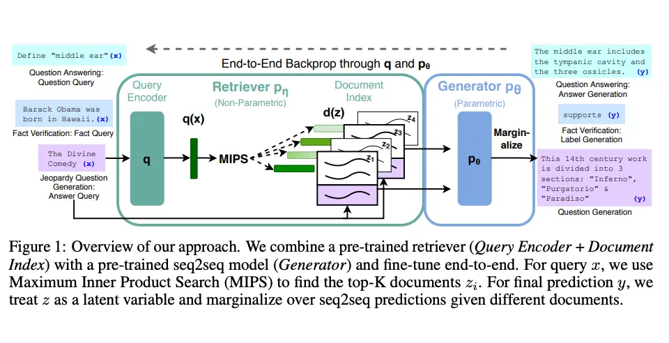
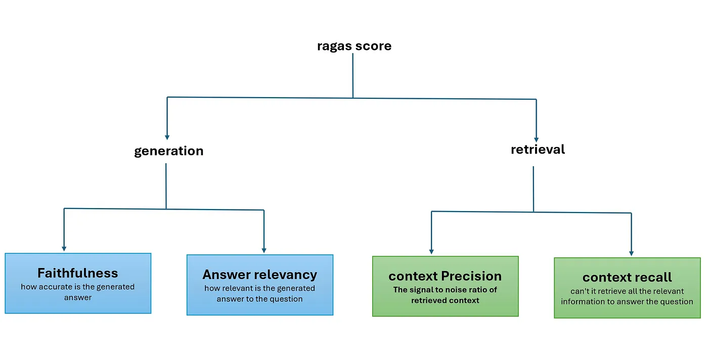

# Retrieval Augmented Generation (RAG)

General-purpose language models can be fine-tuned for tasks like sentiment analysis and named entity recognition, which don’t require extra background knowledge.  

For more complex, knowledge-intensive tasks, integrating external knowledge sources can enhance factual accuracy, improve reliability, and reduce hallucinations.  

To tackle this, Meta AI introduced **Retrieval-Augmented Generation (RAG)**, which combines information retrieval with text generation. Instead of relying solely on a model’s static knowledge, RAG retrieves relevant documents (e.g., from Wikipedia) and uses them as context when generating responses. This allows models to stay updated without requiring frequent retraining.  

[Lewis et al. (2021)](https://arxiv.org/pdf/2005.11401) proposed a fine-tuning approach for RAG, where a pre-trained seq2seq model serves as parametric memory, and a dense vector index of Wikipedia functions as non-parametric memory, accessed via a neural retriever.



## Components in a RAG pipeline:
**Retriever component:**  retrieves additional context from an external database for the LLM to answer the query.
    
**Generator component:** generates an answer based on a prompt augmented with the retrieved information.

## Existing RAG Techniques
Here are the details of all the Advanced RAG techniques covered in this repository.

| Techniques | Description |
| --- | --- |
| Native RAG | Combines retrieved data with LLMs for simple and effective responses. |
| Hybrid RAG | Combines vector search and traditional methods like BM25 for better information retrieval. |
| Hyde RAG | Creates hypothetical document embeddings to find relevant information for a query. |
| Parent Document Retriever | Breaks large documents into small parts and retrieves the full document if a part matches the query. |
| RAG fusion | Generates sub-queries, ranks documents with Reciprocal Rank Fusion, and uses top results for accurate responses. |
| Contextual RAG | Compresses retrieved documents to keep only relevant details for concise and accurate responses. |
| Rewrite Retrieve Read (RRR) | Improves query, retrieves better data, and generates accurate answers. |
| Unstructured RAG | This method designed to handle documents that combine text, tables, and images. |

## RAG
- Agentic RAG: Use an agent to figure out how to retrieve the most relevant information before using the retrieved information to answer the user's question.
- Adaptive RAG: Adaptive RAG is a strategy for RAG that unites (1) query analysis with (2) active / self-corrective RAG. Implementation of: https://arxiv.org/abs/2403.14403
  - For a version that uses a local LLM: Adaptive RAG using local LLMs
- Corrective RAG: Uses an LLM to grade the quality of the retrieved information from the given source, and if the quality is low, it will try to retrieve the information from another source. Implementation of: https://arxiv.org/pdf/2401.15884.pdf
  - For a version that uses a local LLM: Corrective RAG using local LLMs
- Self-RAG: Self-RAG is a strategy for RAG that incorporates self-reflection / self-grading on retrieved documents and generations. Implementation of https://arxiv.org/abs/2310.11511.
  - For a version that uses a local LLM: Self-RAG using local LLMs
- SQL Agent: Build a SQL agent that can answer questions about a SQL database.

## Evaluation

Why BLEU and ROUGE Fall Short for RAG

In RAG applications, the primary goal is not just to generate responses that look similar to reference answers but to ensure that the responses are factually correct, relevant, and supported by retrieved documents. BLEU and ROUGE, while useful for general text generation tasks, do not adequately address these needs. This is where RAGAS metrics, specifically designed for RAG models, become essential.



RAGAS represent evaluate the retrieval component (context_relevancy and context_recall) and the generative component (faithfulness and answer_relevancy) separately

**Faithfulness:** measures the factual accuracy of the generated response based on the retrieved documents.

**Answer Relevancy:** evaluates how relevant the generated response is to the original query.

**Context Precision:** measures the precision of the retrieved documents in providing relevant information to the query.

**Context Recall:** assesses how well the retrieved documents cover all relevant aspects of the query.

## Sample RAGAS implementations
```
from datasets import Dataset
from ragas import evaluate
from ragas.metrics import (
    answer_relevancy,
    faithfulness,
    context_recall,
    context_precision,
    context_entity_recall,
    answer_similarity,
    answer_correctness
)

from ragas.metrics.critique import (
    harmfulness, 
    maliciousness, 
    coherence, 
    correctness, 
    conciseness
)

# Example data
data = {
    "query": ["What is the capital of France?"],
    "generated_response": ["Paris is the capital of France."],
    "retrieved_documents": [["Paris is the capital of France. It is a major European city known for its culture."]]
}

# Convert the data to a Hugging Face Dataset
dataset = Dataset.from_dict(data)

# Define the metrics you want to evaluate
metrics = [
    faithfulness,
    answer_relevancy,
    answer_correctness,
    context_precision,
    context_recall,
]

# Evaluate the dataset using the selected metrics
results = evaluate(dataset, metrics)

# Display the results
for metric_name, score in results.items():
    print(f"{metric_name}: {score:.2f}")
```

## Appendix 
- Semantic Chunking
  - Breakpoint-based Semantic Chunker
  - Clustering-based Semantic Chunker
- Agentic Chunking
- [Qu et al. (2024)](https://arxiv.org/abs/2410.13070) Is Semantic Chunking Worth the Computational Cost? 
- [Chen et al. (2024)](https://arxiv.org/pdf/2312.06648) Dense X Retrieval: What Retrieval Granularity Should We Use?
- [Jiang et al. (2024)](https://arxiv.org/pdf/2406.15319v1) LongRAG: Enhancing Retrieval-Augmented Generation with Long-context LLMs
- [Langchain-RAG](https://github.com/langchain-ai/rag-from-scratch?tab=readme-ov-file)